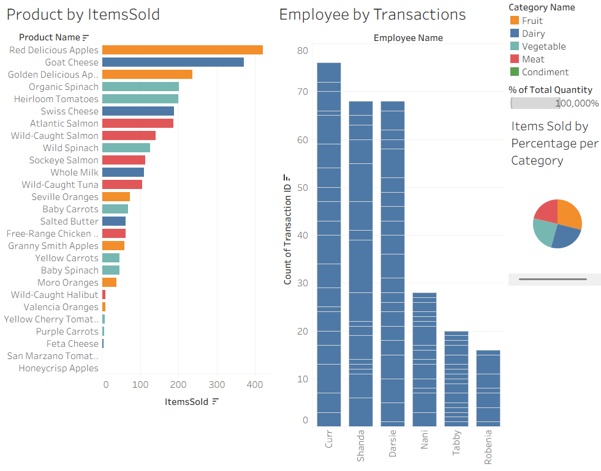
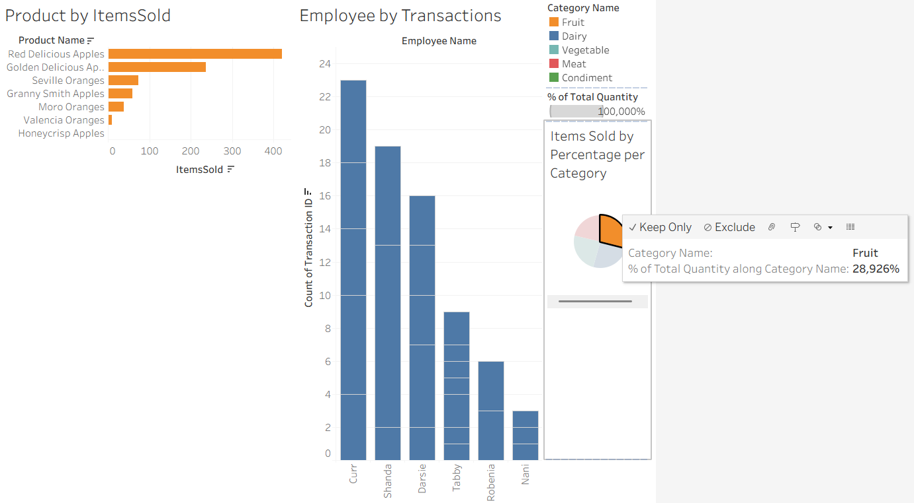
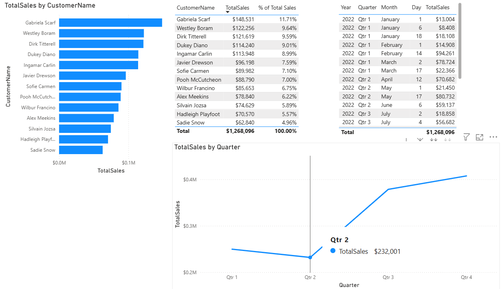
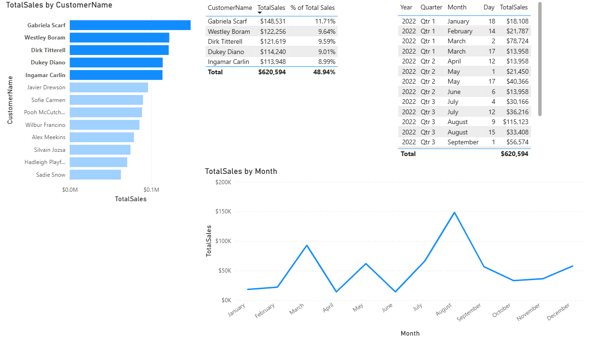

# Data Visualization Dashboards (Tableau & Power BI)

This repository contains interactive dashboards built with Tableau and Power BI using sales transaction data.  
Users can explore sales per product, per category, and per employee, with interactive filtering.

## Tableau
**File:** `tableau/hehegroceries.twbx`

**Features:**
- Products by Items Sold: Shows total quantity sold per product.
- Employee by Transactions: Shows total transactions per employee.
- Category Sales Pie Chart: Shows percentage of items sold by category.
- Interactive: Selecting items in one chart filters/updates the others.

**Screenshots:**

## Power BI
**File:** `powerbi/hehegroceries.pbix`

**Features:**
- Total Sales per Customer: Shows each customer’s total purchase value.
- Percent of Total Sales: Calculates each customer’s contribution to overall sales.
- Revenue Over Time: Visualizes sales by year, quarter, and month, highlighting Q3 and Q4 as peak periods.
- Ability to filter by month, year, or customer.

**Screenshots:**

**Insights:**
- Fruit category contributes ~30% of total revenue.
- Top 5 customers generate ~50% of total sales.
- Revenue grows steadily throughout the year, with Q3 and Q4 generating the highest sales, peaking in August and December.

## Data
CSV files used in dashboards are available in the `data/` folder.
